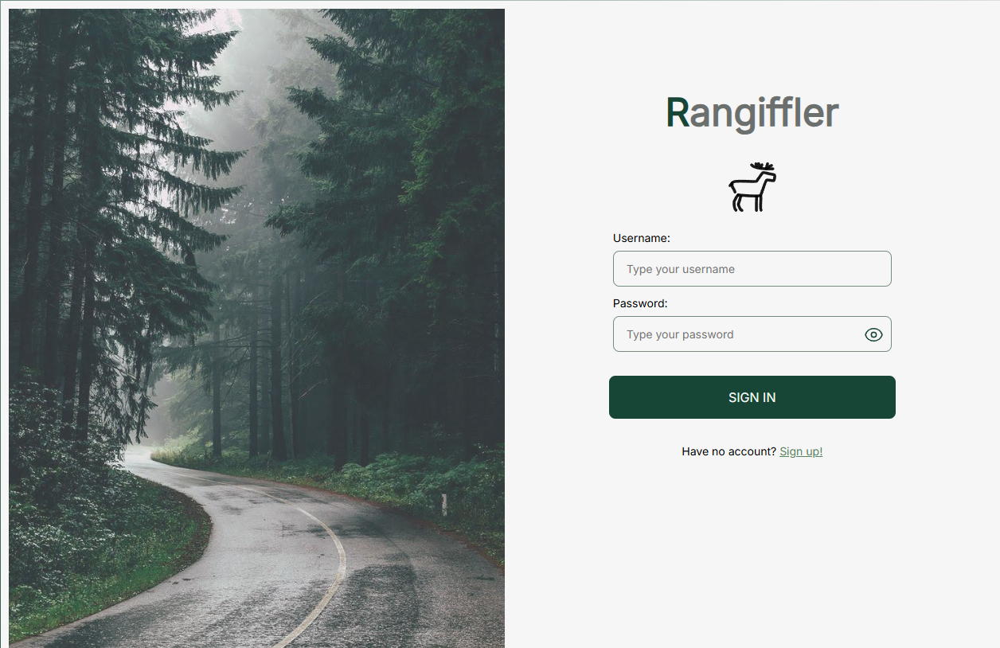
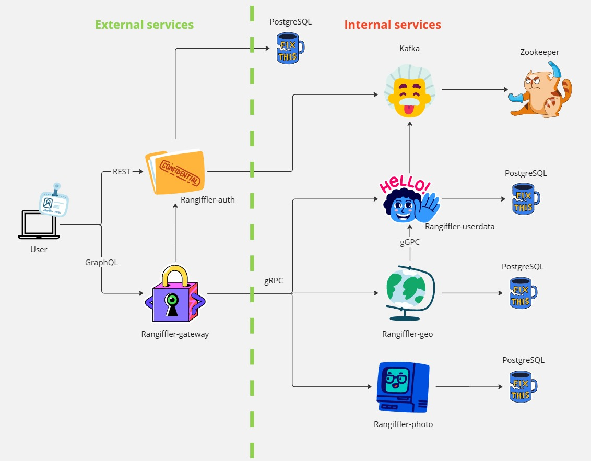
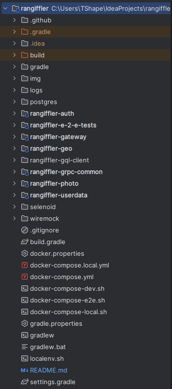
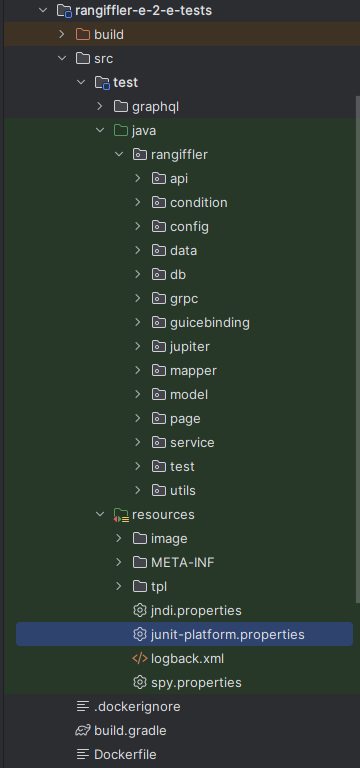
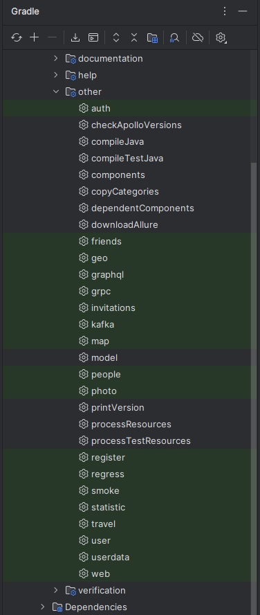
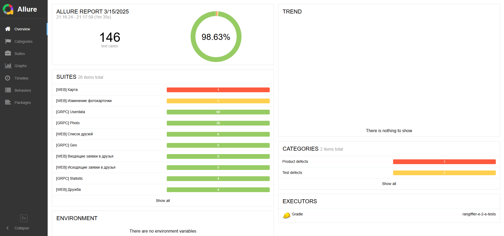
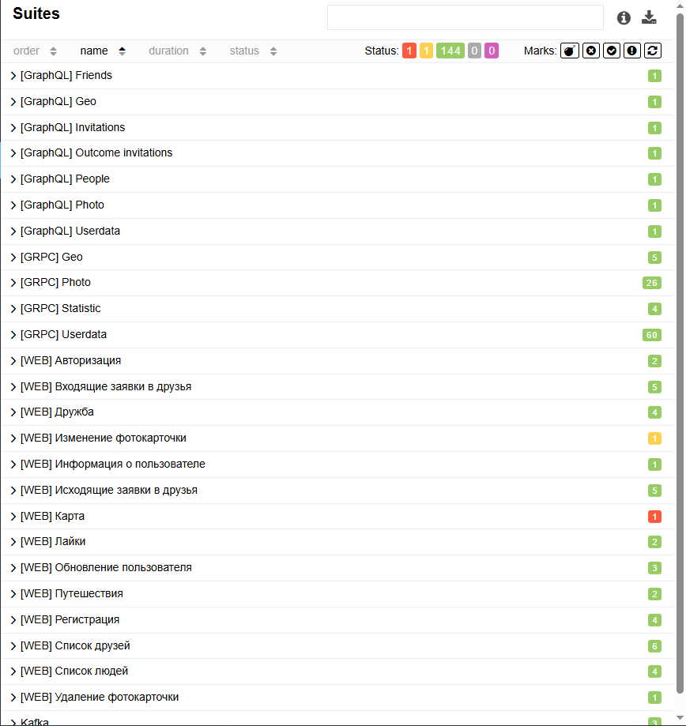
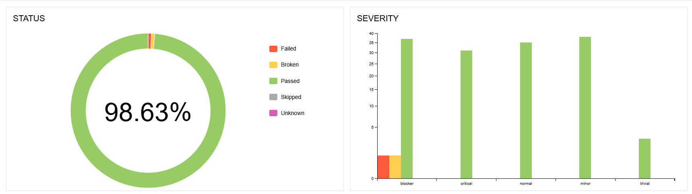
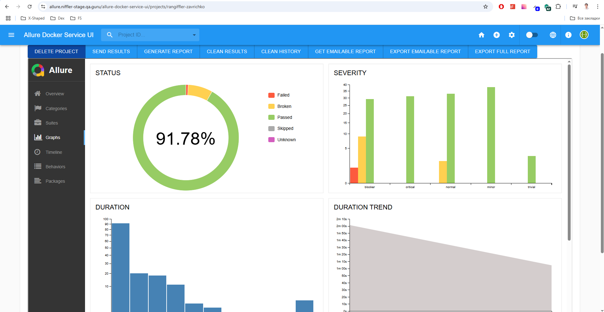

## :cherry_blossom:	Содержание


> ➠ [О проекте](#earth_africa-О-проекте)> 
> ➠ [Технологический стек](#classical_building-технологии-использованные-в-rangiffler)
> ➠ [Схема проекта](#robot-схема-проекта-rangiffler)
> ➠ [Минимальные предусловия для работы с проектом Rangiffler](#skier-минимальные-предусловия-для-работы-с-проектом-rangiffler)
> ➠ [Запуск Rangiffler локально в IDE:](#frog-Запуск-Rangiffler-локально-в-IDE)
> ➠ [Создание своего docker repository для форка Rangiffler и сборка своих докер контейнеров](#skier-Создание-своего-docker-repository-для-форка-Rangiffler-и-сборка-своих-докер-контейнеров)
> ➠ [Структура проекта](#robot-структура-проекта)
> ➠ [Структура тестового проекта](#frog-структура-тестового-проекта)>
> ➠ [Запуск кастомных задач](#robot-запуск-кастомных-задач)
> ➠ [Отчет о результатах тестирования в Allure Report](#skier-отчет-о-результатах-тестирования-в-allure-report)


## :earth_africa: О проекте
Rangiffler — это увлекательный проект о путешествиях, где можно отмечать любимые места на карте, делиться впечатлениями с друзьями, находить новых единомышленников и сохранять яркие моменты в фотографиях.



## :classical_building: **Технологии, использованные в Rangiffler**

- [Spring Authorization Server](https://spring.io/projects/spring-authorization-server)
- [Spring OAuth 2.0 Resource Server](https://docs.spring.io/spring-security/reference/servlet/oauth2/resource-server/index.html)
- [Spring data JPA](https://spring.io/projects/spring-data-jpa)
- [Spring Web](https://docs.spring.io/spring-framework/docs/current/reference/html/web.html#spring-web)
- [Spring actuator](https://docs.spring.io/spring-boot/docs/current/reference/html/actuator.html)
- [Spring gRPC by https://github.com/yidongnan](https://yidongnan.github.io/grpc-spring-boot-starter/en/server/getting-started.html)
- [Spring web-services](https://docs.spring.io/spring-ws/docs/current/reference/html/)
- [Apache Kafka](https://developer.confluent.io/quickstart/kafka-docker/)
- [Docker](https://www.docker.com/resources/what-container/)
- [Docker-compose](https://docs.docker.com/compose/)
- [Postgres](https://www.postgresql.org/about/)
- [React](https://ru.reactjs.org/docs/getting-started.html)
- [GraphQL](https://graphql.org/)
- [Thymeleaf](https://www.thymeleaf.org/)
- [Jakarta Bean Validation](https://beanvalidation.org/)
- [Jakarta JAXB](https://eclipse-ee4j.github.io/jaxb-ri/)
- [JUnit 5 (Extensions, Resolvers, etc)](https://junit.org/junit5/docs/current/user-guide/)
- [Retrofit 2](https://square.github.io/retrofit/)
- [Allure](https://docs.qameta.io/allure/)
- [Selenide](https://selenide.org/)
- [Selenoid & Selenoid-UI](https://aerokube.com/selenoid/latest/)
- [Allure-docker-service](https://github.com/fescobar/allure-docker-service)
- [Java 21](https://adoptium.net/en-GB/temurin/releases/)
- [Gradle 8.6](https://docs.gradle.org/8.6/release-notes.html)
- [GHA](https://docs.github.com/en/actions)
- И многие другие

Рекомендуемые материалы к просмотру (прочтению):

- [Implementing an OAuth 2 authorization server with Spring Security - the new way! by Laurentiu Spilca](https://youtu.be/DaUGKnA7aro)
- [Full Stack OAuth 2 - With Spring Security / React / Angular Part 1](https://youtu.be/SfNIjS_2H4M)
- [Full Stack OAuth 2 - With Spring Security / React / Angular Part 2](https://youtu.be/3bGer6-6mdY)
- [Spring Data? Да, та! by Евгений Борисов](https://youtu.be/nwM7A4TwU3M)
- [Spring – Глубоко и не очень by Евгений Борисов](https://youtu.be/nGfeSo52_8A)
- [Spring-потрошитель, часть 1 by Евгений Борисов](https://youtu.be/BmBr5diz8WA)
- [Spring-потрошитель, часть 2 by Евгений Борисов](https://youtu.be/cou_qomYLNU)
- [Spring-построитель by Евгений Борисов](https://youtu.be/rd6wxPzXQvo)
- [Перенимаем опыт Google в построении микросервисов с gRPC by Александр Борисов](https://youtu.be/zPbaKUIcFx0)
- [Designing a friendships database structure: Should I use a multivalued column?](https://dba.stackexchange.com/questions/135941/designing-a-friendships-database-structure-should-i-use-a-multivalued-column)
- [Гонсалвес Э.: Изучаем Java EE 7, глава "Глава 4. Java.Persistence.API"](https://www.litres.ru/book/entoni-gonsalves/izuchaem-java-ee-7-8480934/otzivi/)
- [(Hopefully) the final article about equals and hashCode for JPA entities with DB-generated IDs](https://jpa-buddy.com/blog/hopefully-the-final-article-about-equals-and-hashcode-for-jpa-entities-with-db-generated-ids/)
-

##  :robot: **Схема проекта Rangiffler**


Приложение Rangiffler построено на основе микросервисной архитектуры:

- [X] auth — управление процессами аутентификации и авторизации.
- [X] gateway — централизованная обработка клиентских запросов и маршрутизация к нужным микросервисам.
- [X] userdata — хранение информации о пользователях, включая имя, фамилию, аватар и другие данные.
- [X] geo — информация о странах и местах путешествий.
- [X] photo — управление фотографиями, загружаемыми путешественниками.
- [X] frontend — пользовательский интерфейс приложения.

Пользователь взаимодействует с системой исключительно через **auth** и **gateway**, используя **GraphQL** для запроса данных через gateway, а REST API — для auth. Прямого доступа к другим микросервисам нет: gateway выполняет роль единой точки входа, а auth отвечает за аутентификацию и передачу информации о пользователях в userdata.

## :skier: **Минимальные предусловия для работы с проектом Rangiffler**

#### 0. Если у вас ОС Windows

Необходимо использовать bash terminal, а не powershell.

#### 1. Установить docker (Если не установлен)

Мы будем использовать docker для БД (Postgres), кроме того, будем запускать микросервисы в едином docker network при
помощи docker-compose

[Установка на Windows](https://docs.docker.com/desktop/install/windows-install/)

[Установка на Mac](https://docs.docker.com/desktop/install/mac-install/) (Для ARM и Intel разные пакеты)

[Установка на Linux](https://docs.docker.com/desktop/install/linux-install/)

После установки и запуска docker daemon необходимо убедиться в работе команд docker, например `docker -v`:

```posh
$ docker -v
Docker version 20.10.14, build a224086
```

#### 2. Спуллить контейнеры postgres:15.1, zookeeper и kafka версии 7.3.2

```posh
docker pull postgres:15.1
docker pull confluentinc/cp-zookeeper:7.3.2
docker pull confluentinc/cp-kafka:7.3.2
```

После `pull` вы увидите спуленный image командой `docker images`

```posh
$ docker images            
REPOSITORY                 TAG              IMAGE ID       CREATED         SIZE
postgres                   15.1             9f3ec01f884d   10 days ago     379MB
confluentinc/cp-kafka      7.3.2            db97697f6e28   12 months ago   457MB
confluentinc/cp-zookeeper  7.3.2            6fe5551964f5   7 years ago     451MB

```

#### 3. Создать volume для сохранения данных из БД в docker на вашем компьютере

```posh
docker volume create pgdata
```

#### 4. Запустить БД, zookeeper и kafka 3-мя последовательными командами:

Запустив скрипт

```posh
$ bash localenv.sh
```

Или выполнив последовательно команды, для *nix:

```posh
docker run --name rangiffler-db -p 5432:5432 -e POSTGRES_PASSWORD=secret -v pgdata:/var/lib/postgresql/data -d postgres:15.1

docker run --name rangiffler-zookeeper -e ZOOKEEPER_CLIENT_PORT=2181 -e ZOOKEEPER_TICK_TIME=2000 -p 2181:2181 -d confluentinc/cp-zookeeper:7.3.2

docker run --name rangiffler-kafka -e KAFKA_BROKER_ID=1 \
-e KAFKA_ZOOKEEPER_CONNECT=$(docker inspect rangiffler-zookeeper --format='{{ .NetworkSettings.IPAddress }}'):2181 \
-e KAFKA_ADVERTISED_LISTENERS=PLAINTEXT://localhost:9092 \
-e KAFKA_OFFSETS_TOPIC_REPLICATION_FACTOR=1 \
-e KAFKA_TRANSACTION_STATE_LOG_MIN_ISR=1 \
-e KAFKA_TRANSACTION_STATE_LOG_REPLICATION_FACTOR=1 \
-p 9092:9092 -d confluentinc/cp-kafka:7.3.2
```

Для Windows:

```posh
docker run --name rangiffler-db -p 5432:5432 -e POSTGRES_PASSWORD=secret -v pgdata:/var/lib/postgresql/data -d postgres:15.1

docker run --name rangiffler-zookeeper -e ZOOKEEPER_CLIENT_PORT=2181 -e ZOOKEEPER_TICK_TIME=2000 -p 2181:2181 -d confluentinc/cp-zookeeper:7.3.2

docker run --name rangiffler-kafka -e KAFKA_BROKER_ID=1 -e KAFKA_ZOOKEEPER_CONNECT=$(docker inspect rangiffler-zookeeper --format='{{ .NetworkSettings.IPAddress }}'):2181 -e KAFKA_ADVERTISED_LISTENERS=PLAINTEXT://localhost:9092 -e KAFKA_OFFSETS_TOPIC_REPLICATION_FACTOR=1 -e KAFKA_TRANSACTION_STATE_LOG_MIN_ISR=1 -e KAFKA_TRANSACTION_STATE_LOG_REPLICATION_FACTOR=1 -p 9092:9092 -d confluentinc/cp-kafka:7.3.2
```

https://github.com/confluentinc/cp-docker-images/issues/801#issuecomment-692085103

#### 5. Установить одну из программ для визуальной работы с Postgres

Например, DBeaver или Datagrip

#### 6. Подключиться к БД postgres (host: localhost, port: 5432, user: postgres, pass: secret, database name: postgres) и создать пустые БД микросервисов

```sql
create
    database "rangiffler-auth" with owner postgres;
create
    database "rangiffler-userdata" with owner postgres;
create
    database "rangiffler-geo" with owner postgres;
create
    database "rangiffler-photo" with owner postgres;
```

#### 5. Установить Java версии 21. Это необходимо, т.к. проект использует синтаксис Java 21

Версию установленной Java необходимо проверить командой `java -version`

```posh
User-MacBook-Pro ~ % java -version
openjdk version "21.0.1" 2023-10-17 LTS
OpenJDK Runtime Environment Temurin-21.0.1+12 (build 21.0.1+12-LTS)
OpenJDK 64-Bit Server VM Temurin-21.0.1+12 (build 21.0.1+12-LTS, mixed mode)
```

Если у вас несколько версий Java одновременно - то хотя бы одна из них должна быть 21
Если java не установлена вовсе, то рекомендую установить OpenJDK (например,
из https://adoptium.net/en-GB/temurin/releases/)

#### 8. Установить пакетый менеджер для сборки front-end npm

[Инструкция](https://docs.npmjs.com/downloading-and-installing-node-js-and-npm).

## :frog: Запуск Rangiffler локально в IDE:

#### 1. Перейти в каталог rangiffler-gql-client

```posh
$ cd rangiffler-gql-client
```

#### 2. Запустить фронтенд (сначала обновить зависимости)

```posh
$ npm i
$ npm run dev
```

Фронт стартанет в твоем браузере на порту 3001: http://127.0.0.1:3001/ Обрати внимание! Надо использовать именно 127.0.0.1, а не localhost, но даже если ты по ошибке перейдешь на localhost, front автоматически тебя перенаправит.

#### 3. Прописать run конфигурацию для всех сервисов rangiffler-* - Active profiles local

Для этого зайти в меню Run -> Edit Configurations -> выбрать main класс -> указать Active profiles: local
[Инструкция](https://stackoverflow.com/questions/39738901/how-do-i-activate-a-spring-boot-profile-when-running-from-intellij).

#### 4 Запустить сервис Rangiffler-auth c помощью gradle или командой Run в IDE:

- Запустить сервис auth

```posh
$ cd rangiffler-auth
$ gradle bootRun --args='--spring.profiles.active=local'
```

Или просто перейдя к main-классу приложения RangifflerAuthApplication выбрать run в IDEA (предварительно удостовериться что
выполнен предыдущий пункт)

#### 5  Запустить в любой последовательности другие сервисы: rangiffler-geo, rangiffler-gateway, rangiffler-photo, rangiffler-userdata

# Запуск Rangiffler в докере:

#### 1. Создать бесплатную учетную запись на https://hub.docker.com/ (если отсутствует)

#### 2. Создать в настройках своей учетной записи access_token

[Инструкция](https://docs.docker.com/docker-hub/access-tokens/).

#### 3. Выполнить docker login с созданным access_token (в инструкции это описано)

#### 4. Прописать в etc/hosts элиас для Docker-имени

#### frontend:  127.0.0.1 frontend.rangiffler.dc,

#### auth:      127.0.0.1 auth.rangiffler.dc

#### gateway:   127.0.0.1 gateway.rangiffler.dc

```posh
##
# Host Database
#
# localhost is used to configure the loopback interface
# when the system is booting.  Do not change this entry.
##
127.0.0.1       localhost
127.0.0.1       frontend.rangiffler.dc
127.0.0.1       auth.rangiffler.dc
127.0.0.1       gateway.rangiffler.dc
```

#### 5. Перейти в корневой каталог проекта

```posh
$ cd rangiffler
```

#### 6. Запустить все сервисы

```posh
$ bash docker-compose-dev.sh
```

Rangiffler при запуске в докере будет работать для вас по адресу http://frontend.rangiffler.dc:80, этот порт НЕ НУЖНО
указывать
в браузере, таким образом переходить напрямую по ссылке http://frontend.rangiffler.dc

Если при выполнении скрипта вы получили ошибку

```
* What went wrong:
Execution failed for task ':rangiffler-auth:jibDockerBuild'.
> com.google.cloud.tools.jib.plugins.common.BuildStepsExecutionException: 
Build to Docker daemon failed, perhaps you should make sure your credentials for 'registry-1.docker.io...
```

То необходимо убедиться, что в `$USER/.docker/config.json` файле отсутствует запись `"credsStore": "desktop"`
При наличии такого ключа в json, его надо удалить

## :skier: Создание своего docker repository для форка Rangiffler и сборка своих докер контейнеров

#### 1. Войти в свою учетную запись на https://hub.docker.com/ и последовательно создать публичные репозитории

- rangiffler-gql-client-docker
- rangiffler-userdata-docker
- rangiffler-photo-docker
- rangiffler-gateway-docker
- rangiffler-geo-docker
- rangiffler-auth-docker

Допустим, что ваш username на https://hub.docker.com - *foobazz*

#### 2. заменить в файле docker.properties (в корне проекта) IMAGE_PREFIX=7423848291787895 на IMAGE_PREFIX=foobazz

- где foobazz - ваш юзернэйм на https://hub.docker.com/

#### 3. заменить в файле build.gradle (в корне проекта) dockerHubName = "7423848291787895" на dockerHubName = "foobazz"

- где foobazz - ваш юзернэйм на https://hub.docker.com/

#### 4. Перейти в корневой каталог проекта

```posh
$ cd rangiffler
```

#### 5. Собрать все images, запушить и запустить rangiffler одной командой:

```posh
$ bash docker-compose-dev.sh push
```

# Запуск e2e тестов в Docker network изолированно Rangiffler в докере:

#### 1. Перейти в корневой каталог проекта

```posh
$ cd rangiffler
```

#### 2. Запустить все сервисы и тесты:

```posh
$ bash docker-compose-test.sh
```

#### 3. Selenoid UI доступен по адресу: http://localhost:9090/

#### 4. Allure доступен по адресу: http://localhost:5050/allure-docker-service/projects/default/reports/latest/index.html


## :robot: Структура-проекта


-[X] .github - настройка интеграции с CI Github Actions
-[X] .gradle - директория сборщика проекта Gradle
-[X] .idea - системная директория IDE
-[X] build - директория корневого проекта
-[X] gradle - директория с gradle wrapper
-[X] img - изображения для README.md
-[X] logs - сохраненные логи микросервисов
-[X] postgres - директория инициализации базы данных
-[X] rangiffler-auth - микросервис регистрации и авторизации
-[X] rangiffler-e-2-e-tests - проект с автотестами
-[X] rangiffler-gateway - микросервис для отправки запросов к другим микросервисам
-[X] rangiffler-geo - микросервис геолокации
-[X] rangiffler-gql-client - фронтенд приложения
-[X] rangiffler-grpc-common - микросервис grpc
-[X] rangiffler-photo - микросервис работы с фотокарточками
-[X] rangiffler-userdata - микросервис работы с пользователями
-[X] selenoid - настройка браузеров
-[X] wiremock - настройка моков
-[X] .gitignore - настройка игнорирования файлов и директорий
-[X] build.gradle - основной файл сборщика проекта
-[X] docker.properties - файл настройки докера
-[X] docker-compose.local.yml - локальный запуск проекта в докере
-[X] docker-compose.yml - основной файл настройки запуска в докере
-[X] docker-compose-dev.sh - shell скрипт для разворачивания приложения без запуска тестов
-[X] docker-compose-e2e.sh - shell скрипт для разворачивания приложения, инфраструктуры и запуском тестов
-[X] docker-compose-local.sh - shell скрипт локального разворачивания приложения в докере
-[X] gradle.properties - настройка сборщика проекта
-[X] gradlew - враппер сборщика проекта
-[X] gradlew.bat - файл запуска враппера сборщика проекта
-[X] localenv.sh - shell скрипт локального запуска приложения
-[X] README.md - текущий файл
-[X] settings.gradle - настройки сборщика проекта


## :frog: Структура тестового проекта


-[X] build - директория сборки тестового проекта
-[X] graphql - директория со схемой graphql и файлами для генерации клиента
-[X] api - директория для создания базового апи клиента
-[X] condition - методы проверок условий
-[X] config - настройка конфигурации
-[X] data - клиент для работы с базой данных
-[X] grpc - клиент для работы с grpc
-[X] guicebinding - клиент для работы с инъекциями
-[X] jupiter - директория с Junit Extensions и аннотациями
-[X] mapper - методы для работы с таблицами
-[X] model - модели для работы с апи, Allure, gql
-[X] page - методы для работы с веб-страницами
-[X] service - сервисы для работы с пользователями через апи и базу данных
-[X] tests - тестовые методы для проверки слоя GraphQL, Grpc, Kafka, Web
-[X] utils - утилитарные классы для генерации тестовых данных, работы со скриншотами и авторизацией
-[X] resources/image - изображения для тестовых методов
-[X] resources/META-ING - настройка работы с Junit Extensions и базой данных
-[X] resources/tpl - настройка шаблонов для Allure Report
-[X] jndi.properties - настройка работы с базой
-[X] junit-platform.properties - настройка параллельного запуска автотестов
-[X] logback.xml - настройка логирования
-[X] spy.properties - настройка работы с базой

## :robot: Запуск кастомных задач


В проекте реализованы тэги для удобного запуска отдельных слоев автотестов, либо функциональности.
```
// Универсальная задача для запуска тестов с тегами
def createTagTask(String name, String tag) {
    tasks.register(name, Test) {
        useJUnitPlatform {
            includeTags(tag)
        }
        testLogging {
            events "passed", "skipped", "failed", "standardOut", "standardError"
            exceptionFormat "short"
        }
    }
}
```

Пример запуска только web тестов:

```
gradle clean web
```

Список всех доступных тэгов:
-[X] graphql - запуск всех тестов на GraphQl
-[X] geo - запуск тестов на геолокацию
-[X] friends - запуск тестов на друзей
-[X] invitations - запуск тестов на приглашения
-[X] people - запуск тестов на людей
-[X] photo - запуск тестов на фотокарточки
-[X] user - запуск тестов на пользователя
-[X] grpc - запуск всех grpc тестов
-[X] statistic - запуск тестов на статистику
-[X] auth - запуск тестов на авторизацию
-[X] kafka - запуск тестов на Kafka
-[X] web - запуск всех веб тестов
-[X] register - запуск тестов на регистрацию
-[X] map - запуск тестов на карту
-[X] travel - запуск тестов путешествий
-[X] userdata - запуск тестов с пользователями
-[X] smoke - запуск основных сценариев
-[X] regress - запуск регрессионных тестов (кроме smoke)


## :skier: Отчет о результатах тестирования в Allure Report




